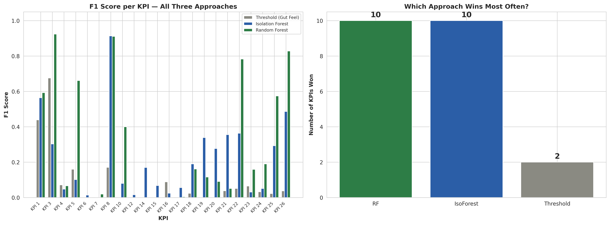
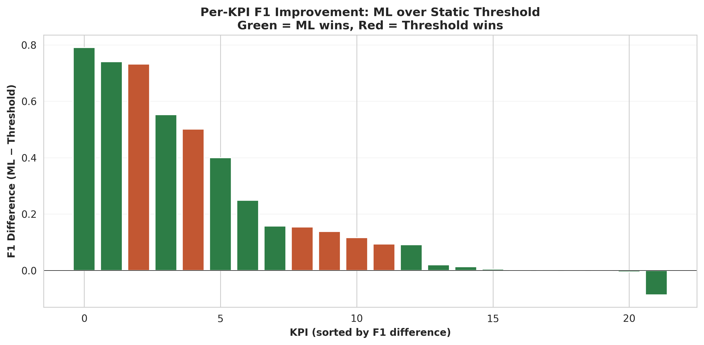
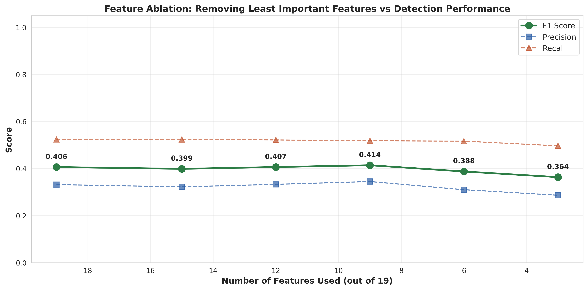
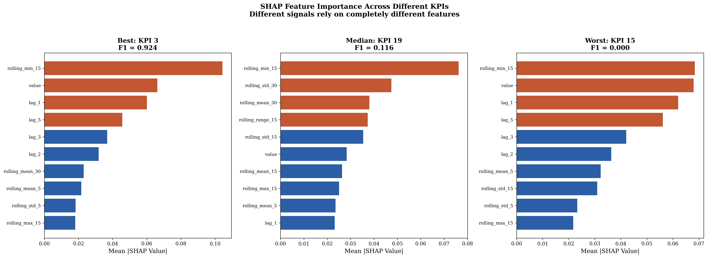
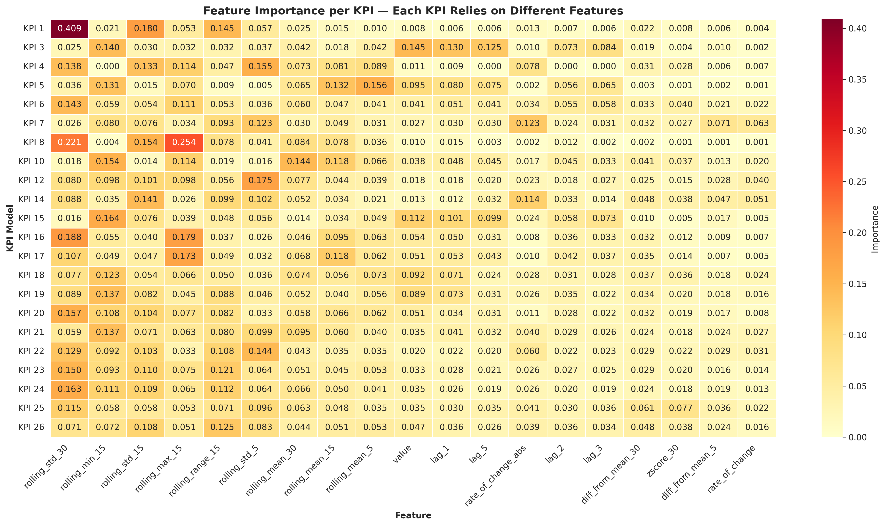
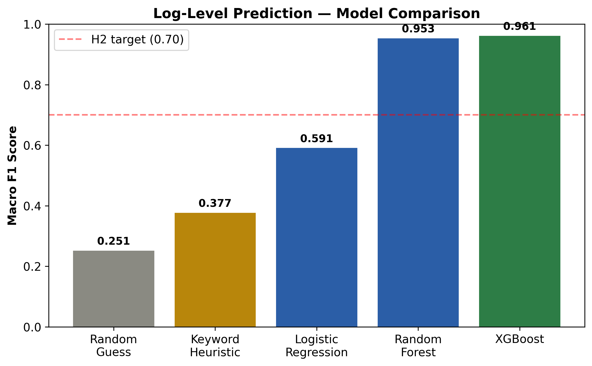
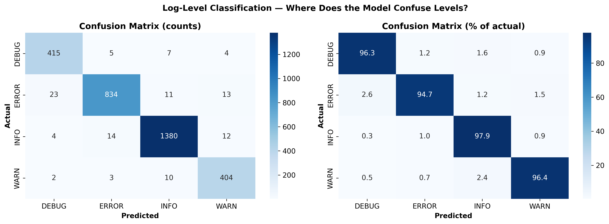
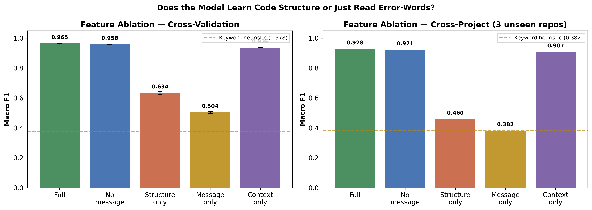
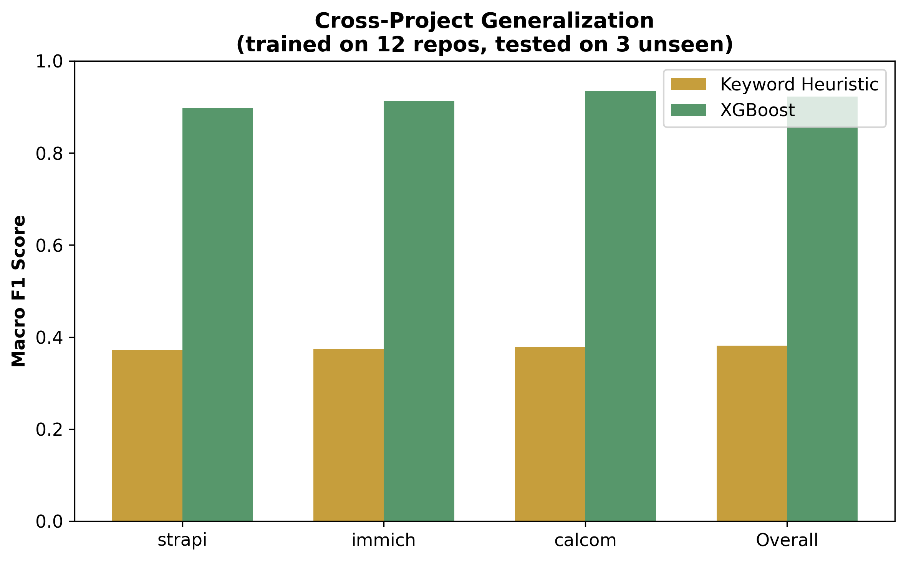
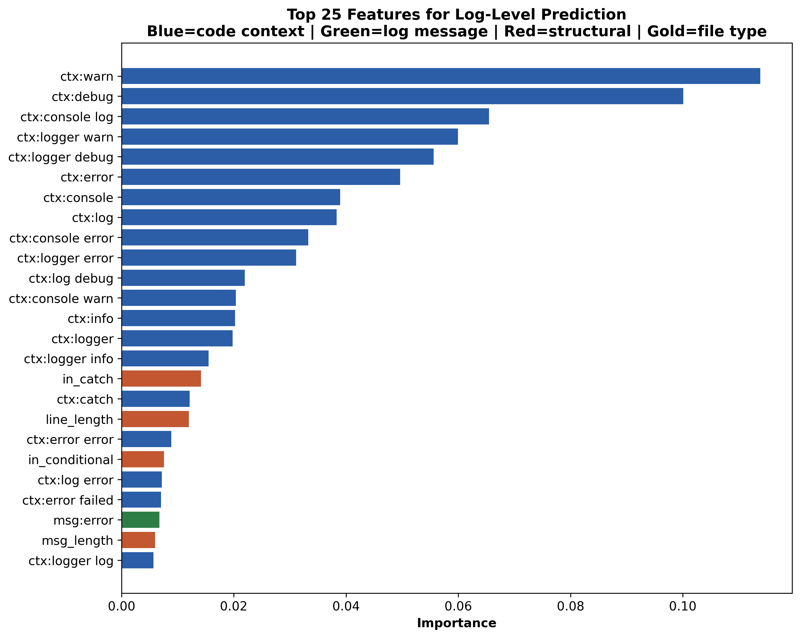

# Beyond Gut Feel: Empirical Evidence That Machine Learning Outperforms Default Rule-Based Practice in Observability Decisions

---

## Abstract

Modern software systems rely on observability infrastructure — metrics, logs, and traces — to detect failures and maintain reliability. In practice, key observability decisions are made through untested defaults: static alerting thresholds, keyword-based log-level selection, and monitoring feature sets chosen by convention rather than evaluation. Despite growing interest in AIOps, no prior study has directly measured the gap between these default rule-based practices and machine learning across both anomaly detection and logging decisions.

We present a two-part empirical study quantifying this gap. In Part A, we evaluate static-threshold baselines (μ ± 3σ) against per-KPI machine learning models on the AIOps 2018 benchmark — 26 KPIs comprising 2.67 million labelled data points. ML models outperformed the static threshold on 91% of evaluable KPIs, though absolute performance varied widely (mean F1 = 0.41, median = 0.116), and an ablation study showed that 53% of monitoring features could be removed without degrading detection. SHAP analysis confirmed that no universal feature ranking exists across KPIs. In Part B, we mine 15,702 log statements from 15 open-source Node.js/TypeScript repositories and train classifiers to predict developer-chosen log levels from code context. The model achieves cross-project macro F1 of 0.92 when surrounding code — including existing log statements — is available, compared to 0.38 for a keyword heuristic. However, a level-name-stripped ablation reveals this drops to 0.52 without neighbouring log-level tokens, showing the dominant signal is inter-statement level clustering rather than deeper code-structural patterns. This clustering generalises across 15 independent codebases and 3 unseen test repositories. Our results demonstrate that default observability practices leave substantial performance on the table, while identifying boundary conditions where simple rules remain competitive.

---

## 1. Introduction

Modern software systems depend on observability infrastructure (metrics, logs, and traces) to detect failures, diagnose incidents, and maintain reliability. As systems grow in scale and complexity, the volume of telemetry data grows with them. The quality of observability decisions - what to monitor, how to detect anomalies, and what severity to assign log statements - directly affects operational effectiveness.

In practice, these decisions are typically made through default rules and conventions rather than empirical evaluation. An engineer writing error-handling code selects a log level based on local convention or personal habit. A site reliability engineer sets an alerting threshold at a round number (80% CPU utilisation, 500ms latency) because it "seems reasonable." A team includes monitoring features like rolling averages, z-scores, or rate-of-change signals based on past experience rather than measured detection value. We call this *gut-feel observability* — the reliance on untested defaults rather than data-driven configuration.

These default practices benefit from accumulated experience, but they have three structural weaknesses. First, they are **inconsistent**: two developers on the same team may assign different log levels to similar error-handling code, so severity labels end up reflecting personal style rather than objective criteria. Second, they are **non-adaptive**: a static alerting threshold cannot handle seasonal load variation, deployment-induced baseline shifts, or the different statistical distributions that different KPIs exhibit. Third, they are **unvalidated**: teams tend to over-engineer monitoring by including signals "just in case," without checking whether those signals actually help detect anomalies or just add noise.

Despite growing interest in AIOps, we have not found a prior study that directly measures the gap between default rule-based practice and machine learning for observability decisions. Existing work on KPI anomaly detection focuses on improving detection algorithms without benchmarking against the static-threshold baselines that teams actually deploy in production. Research on log-level prediction has covered Java and C/C++ codebases but has not, to our knowledge, studied the Node.js/TypeScript ecosystem, evaluated cross-project generalisation by holding out entire repositories, or framed the comparison as an explicit test of developer heuristics against learned models.

This paper presents a two-part empirical study that quantifies the cost of gut-feel observability. In **Part A**, we use the AIOps 2018 KPI Anomaly Detection benchmark - 26 key performance indicators comprising 2.67 million labelled data points - to compare static-threshold baselines against per-KPI machine learning models, measure feature waste through ablation, and explain per-KPI decision surfaces through SHAP analysis. In **Part B**, we mine 15,702 log statements from 15 open-source Node.js and TypeScript repositories, train classifiers to predict the developer-chosen log level from code context, and evaluate generalisation on three entirely unseen projects.

Our contributions are:

1. **The first explicit empirical comparison of rule-based heuristics and machine learning for observability decisions**, spanning both anomaly detection and log-level selection, with baselines designed to approximate current default practice.
2. **Evidence that feature waste is substantial in monitoring pipelines**: an ablation study removes 53% of manually engineered features (within a multi-window rolling-statistic feature set) with no loss in anomaly detection performance, and SHAP analysis reveals that no universal feature ranking exists across KPIs.
3. **Evidence that log levels cluster within files, and the clustering generalises**: a log-level classifier trained on 15 open-source repositories achieves cross-project macro F1 of 0.92 when surrounding code (including existing log statements) is available, compared to 0.38 for a keyword heuristic — but a level-name-stripped ablation reveals this drops to 0.52 without neighbouring log-level tokens, showing that the dominant signal is inter-statement level clustering rather than deeper code-structural patterns. This clustering is consistent across 15 independent codebases and 3 unseen test repositories.
4. **Evidence of systematic inconsistency in developer logging decisions**: error analysis reveals that individual developer log-level choices deviate from corpus-wide norms, with the model surfacing cases where the same structural context receives different labels across projects.

The remainder of this paper is structured as follows. Section 2 reviews related work in KPI anomaly detection, log-level prediction, and AIOps. Section 3 describes the datasets, feature engineering, models, and evaluation methodology for both studies. Section 4 presents the experimental results. Section 5 discusses implications, limitations, and practical applications. Section 6 analyses threats to validity. Section 7 concludes the paper.

## 2. Related Work

### 2.1 KPI Anomaly Detection

KPI anomaly detection has received significant attention in the AIOps research community. The AIOps 2018 competition established a widely used benchmark comprising labelled KPI time series from internet-company infrastructure [1]. Subsequent work has explored a range of algorithmic approaches: Xu et al. [2] proposed a variational auto-encoder for unsupervised detection on seasonal KPIs; Li et al. [3] developed robust clustering methods for rapid KPI grouping; Ren et al. [4] described a time-series anomaly detection service deployed at scale at Microsoft.

These studies share a common evaluation pattern: they benchmark proposed algorithms against other ML or statistical methods. This advances detection accuracy, but leaves a practical question open: how do these methods compare against the static-threshold rules that engineering teams actually deploy in production? Statistical alerting rules such as μ ± kσ, fixed-percentage thresholds, and manual anomaly score cutoffs remain the dominant starting point for production monitoring, yet they rarely appear as baselines in the research literature. Our Part A study addresses this gap by including a static-threshold baseline (μ ± 3σ over a rolling window) and measuring per-KPI performance differences - reported as win/loss counts, median improvement, and analysis of the tail where ML underperforms - rather than a single aggregate that would obscure the KPI-level heterogeneity central to our findings.

### 2.2 Log-Level Prediction and Logging Practices

A related line of work has studied logging practices in software projects. He et al. [5] characterised the natural language descriptions in log statements. Chen and Jiang [6] studied logging practices across Apache Software Foundation projects, finding significant variation in logging density, level distribution, and modification frequency across projects and developers. Zhu et al. [7] proposed a model to help developers make informed logging decisions, and Yuan et al. [9] characterised logging practices in open-source software.

More directly related to our work, Li et al. [10] framed log-level suggestion as an ordinal regression problem, training models on Java projects to recommend DEBUG, INFO, WARN, or ERROR based on code context features such as block type, log text content, and surrounding method characteristics. Li et al. [11] extended this line with DeepLV, a deep-learning approach that embeds syntactic and semantic features for the same task. These studies show that log-level selection is not arbitrary. It correlates with code structure, error-handling patterns, and surrounding context in ways that models can learn.

However, the existing log-level prediction literature has three gaps that our Part B study addresses. First, prior work has focused on Java and C/C++ ecosystems; to our knowledge, no study has examined the Node.js and TypeScript ecosystem. While production Node.js services that adopt structured loggers such as winston, pino, or bunyan use a level hierarchy similar to Java's log4j (trace/debug/info/warn/error/fatal), the ecosystem also includes widespread use of `console.log/warn/error` - which has no direct Java analogue - and callback-based and Promise-chain error handling patterns that produce structurally different logging contexts. Our study is the first to cover this mix of console-based and structured logging in a JavaScript/TypeScript setting. Second, prior evaluations are predominantly within-project or random train/test splits; we are not aware of an evaluation that holds out entire repositories to test cross-project generalisation - whether a model trained on one set of projects can predict log levels in codebases it has never seen. Third, prior work compares ML models against other ML models or against majority-class baselines, rather than against an explicit formalisation of developer heuristics. Our keyword-heuristic baseline captures the lexical cues a developer might apply (keywords such as "fail," "error," "retry" triggering specific level predictions) and structural signals (e.g., presence in a `catch` block), though it does not capture the richer control-flow reasoning, cross-statement context, or domain-specific judgment that a developer brings. It therefore represents a deliberately simplified proxy for rule-based human decision-making - a lower bound rather than a ceiling - making the comparison between heuristic and learned model conservative.

### 2.3 Feature Engineering and Selection for Monitoring

Effective anomaly detection depends on both model selection and feature quality. In production, engineering teams typically pick features based on operational experience, choosing rolling averages, percentile calculations, or rate-of-change signals that worked in past incidents. This process is rarely evaluated empirically: features get added but seldom removed, leading to signal redundancy.

The machine learning literature provides well-established methods for feature selection, including filter methods, wrapper methods, and embedded importance measures [8]. However, these techniques have been studied primarily on standard classification and regression benchmarks, not on telemetry time-series data where class imbalance is extreme (anomaly rates below 3%) and feature interactions are KPI-specific. Our ablation study in Part A applies systematic feature removal to monitoring features specifically, measuring the point at which removing manually engineered features begins to degrade detection performance. The finding that 53% of features can be removed without hurting performance is direct evidence of feature waste, with clear implications for how monitoring pipelines are built.

### 2.4 Explainability in AIOps

As ML models get deployed in operational settings, the need for explainable decisions grows with them. SHAP (SHapley Additive exPlanations) [12], based on cooperative game theory, provides a principled method for attributing model predictions to individual input features. SHAP has been applied to a range of domains including healthcare, finance, and natural language processing, but its application to AIOps remains limited.

In the context of anomaly detection, explainability serves a dual purpose: it helps operators understand *why* a specific data point was flagged, and it reveals which monitoring signals carry the most diagnostic value. Our use of SHAP in Part A serves the latter purpose - rather than explaining individual predictions, we use SHAP to compare feature importance rankings across KPIs. The finding that these rankings vary substantially across KPIs challenges the assumption that a single "best practice" feature set can serve as a universal monitoring configuration.

### 2.5 Summary

Existing research has advanced anomaly detection algorithms and characterised logging practices, but four gaps remain. To our knowledge, no study benchmarks ML anomaly detection against the static-threshold baselines developers deploy. No log-level study covers the Node.js/TypeScript ecosystem or evaluates cross-project generalisation with entire repositories held out. We are not aware of work that quantifies feature waste in monitoring pipelines through systematic ablation. And we have not found a study that unifies anomaly detection and log-level prediction under a common framing that explicitly tests whether default rule-based practice is outperformed by learned models. This paper addresses all four gaps through a two-part empirical study.

## 3. Methodology

### 3.1 Overview

We conduct two complementary empirical studies. Part A evaluates whether machine learning models outperform static-threshold baselines for anomaly detection across heterogeneous KPIs. Part B evaluates whether machine learning models outperform keyword-based heuristics for predicting developer-chosen log levels from source code context. The two parts share a common experimental logic: in each case, we formalise a rule-based approach that approximates current practice, train ML models on the same data, and measure the performance gap. Figure 1 provides an overview of the study design.

### 3.2 Part A - KPI Anomaly Detection

#### 3.2.1 Dataset

We use the AIOps 2018 KPI Anomaly Detection dataset released by Tsinghua University's NetMan Lab [1]. The dataset contains 2.67 million data points across 26 KPIs collected from real internet-company infrastructure. Each data point consists of a timestamp, a KPI value, and a binary anomaly label assigned by site reliability engineers. The scrape interval is approximately one minute. The overall anomaly rate is 2.16%, with individual KPIs ranging from 0.02% to 8.21%.

We selected this dataset for three reasons. First, it is the most widely used public benchmark for KPI anomaly detection, enabling comparison with prior work. Second, the labels were assigned by domain experts, not generated synthetically, providing realistic ground truth. Third, the 26 KPIs exhibit substantial heterogeneity in scale, distribution shape, and anomaly pattern - precisely the diversity needed to test whether a single rule-based approach can generalise.

#### 3.2.2 Feature Engineering

From each KPI's raw time series, we retain the raw value and derive 18 additional features organised into five groups:

**Rolling statistics** (9 features): Rolling mean and standard deviation at window sizes 5, 15, and 30 minutes (6 features), plus rolling minimum, maximum, and range (max - min) at window size 15 (3 features). The mean and standard deviation at multiple windows capture short-, medium-, and longer-term trends, while the min/max/range at a single window captures the spread of recent values. A sudden deviation from the rolling mean, for example, may indicate an anomaly - but whether it does depends on the KPI and the window size, which is precisely what the model learns.

**Deviation features** (3 features): The difference between the current value and the rolling mean at windows 5 and 30 (2 features), and the z-score at window 30, defined as (*value* - *rolling_mean_30*) / *rolling_std_30*, which measures how many standard deviations the current value lies from the recent mean. The z-score is the feature most commonly used in manual threshold rules, making it a direct point of comparison between rule-based and learned approaches.

**Rate-of-change features** (2 features): The difference between consecutive values (rate of change) and its absolute value. These capture the speed and magnitude of change regardless of direction. An accelerating metric behaves differently from one that is elevated but stable.

**Lag features** (4 features): The raw KPI value at offsets *t*-1, *t*-2, *t*-3, and *t*-5, capturing short-term momentum and periodicity patterns.

**Raw value** (1 feature): The unmodified KPI value at time *t*, included as a reference for the derived features.

In total, the feature set comprises 9 rolling statistics, 3 deviation features (2 diff-from-mean + 1 z-score), 2 rate-of-change features, 4 lag features, and 1 raw value, yielding **19** features per data point after excluding the initial window warm-up period.

#### 3.2.3 Static-Threshold Baseline

The baseline flags a data point as anomalous when its raw value falls outside μ ± 3σ, where μ and σ are computed over a rolling 60-minute window. This rule operationalises the common alerting practice of "flag anything more than three standard deviations from the recent average."

This baseline captures the *statistical logic* behind many production alerting rules. Tools like Prometheus, Datadog, and CloudWatch offer threshold-based alerting that follows this general pattern. However, it does not capture the full depth of expert judgment: a skilled SRE tunes thresholds using domain knowledge (e.g., known batch-processing windows), incident history (e.g., prior outage patterns), and asymmetric cost preferences (e.g., preferring false alerts over missed incidents for revenue-critical services). Our baseline represents a *default rule-based approach*, the starting point before domain-specific tuning, not the ceiling of what an expert could achieve. We revisit this distinction in Section 6 (Threats to Validity).

#### 3.2.4 Machine Learning Models

For each of the 26 KPIs, we independently train two models:

**Random Forest classifier** (*n_estimators*=200, *max_depth*=20, *class_weight*='balanced', *random_state*=42). Random Forest builds an ensemble of decision trees, each trained on a random subset of the data and features, and predicts via majority vote. We set *class_weight*='balanced' to address class imbalance by assigning higher weight to the minority (anomaly) class during training. This is essential given anomaly rates as low as 0.02%.

**Isolation Forest** (*n_estimators*=200, *contamination* set to each KPI's observed anomaly rate, *random_state*=42). Unlike Random Forest, which learns to classify labelled examples, Isolation Forest is an unsupervised method that identifies anomalies by measuring how easily data points can be isolated through random binary partitions. Anomalous points, being rare and different, require fewer partitions to isolate. We include this model to test whether an unsupervised approach - which makes no use of the anomaly labels during training - can still outperform a static threshold.

The decision to train *per-KPI* models rather than a single model across all KPIs is a core methodological choice motivated by an initial failed experiment. When we trained a single Random Forest on all 26 KPIs combined, the resulting model achieved a macro F1 of only 0.08 - barely above random. This failure shows that KPI distributions are too different from each other: a decision boundary learned from CPU utilisation data does not transfer to request latency or error-rate data. Per-KPI modeling increased mean F1 from 0.08 to 0.41, and we report this negative result as a finding in its own right.

For each KPI, we select the better-performing model (Random Forest or Isolation Forest) based on F1 score on the test set. We report the results as win/loss/tie counts across all 26 KPIs, the distribution of F1 improvements over the static threshold, and a specific analysis of the 2 KPIs where the threshold outperformed ML - including why this occurred (Section 4.2).

#### 3.2.5 Ablation Study

To quantify feature waste, we conduct an ablation study. We rank all 19 features by their mean Random Forest feature importance across KPIs, then progressively remove the least-important features and retrain all per-KPI models. At each removal step, we record the aggregate F1 score. The ablation identifies the point at which further removal degrades performance, revealing how many features can be discarded without cost.

#### 3.2.6 SHAP Analysis

We apply SHAP (SHapley Additive exPlanations) [12] to the best-performing model for 3 representative KPIs selected by detection performance: the best (highest F1), median, and worst (lowest non-zero F1) performers. For each KPI, we generate beeswarm plots showing the direction and magnitude of each feature's contribution to anomaly-class predictions, and bar plots showing mean absolute SHAP values. The primary analytical question is whether feature importance rankings are consistent across KPIs or KPI-specific - a finding with direct implications for whether a universal monitoring configuration is feasible. We supplement the per-KPI SHAP analysis with a heatmap of Random Forest feature importances across all evaluable KPIs to confirm the finding at full scale.

### 3.3 Part B - Log-Level Classification

#### 3.3.1 Dataset Construction

We construct a dataset of log statements mined from 15 open-source Node.js and TypeScript repositories on GitHub. Repositories were selected to span diverse application domains (web frameworks, ORMs, content management systems, workflow automation, photo management, scheduling) and to represent mature, actively maintained projects with substantial logging activity. Table A1 in the Appendix lists all repositories with their domains and sample counts.

For each repository, we clone the latest default branch and apply a regex-based extraction pipeline that identifies calls to standard logging functions (`console.log`, `console.warn`, `console.error`, `console.debug`) and structured logging frameworks (`logger.info`, `logger.warn`, `this.logger.error`, etc.). For each matched log statement, we extract:

- **Log level**: The method name called by the developer (DEBUG, INFO, WARN, or ERROR), treated as the ground truth label.
- **Log message**: The string argument passed to the logging function.
- **Log line**: The full source line containing the log call.
- **Surrounding code context**: The 5 lines before and 5 lines after the log statement, concatenated as `full_context`.
- **Function name**: The enclosing function or method name, when identifiable.
- **Structural features**: Boolean indicators for whether the log statement appears inside a `catch` block, `try` block, or conditional statement; whether the enclosing function contains `return` or `throw` statements; the count of variable declarations in the surrounding context; the character length of the log message; and the character length of the full log line.
- **File type**: Classified as `controller`, `service`, `middleware`, `route`, `model`, `util`, `config`, `test`, or `unknown` based on file path patterns.

After extraction, we filter rows with corrupted CSV formatting (caused by unescaped commas and newlines in code context) by retaining only rows with valid log levels in {DEBUG, INFO, WARN, ERROR} and converting boolean string values to integers. The final dataset contains **15,702 log statements** with the following class distribution: INFO 45.0%, ERROR 28.0%, DEBUG 13.7%, WARN 13.3%.

#### 3.3.2 Feature Engineering

We construct the feature matrix by combining four feature groups:

**Code context TF-IDF** (500 features): We apply Term Frequency-Inverse Document Frequency vectorisation to the `full_context` field using unigrams and bigrams, a minimum document frequency of 5, a maximum document frequency of 80%, and a token pattern matching identifier-like strings (`[a-zA-Z_][a-zA-Z0-9_]{1,30}`). TF-IDF assigns high weight to terms that are frequent in a specific log statement's context but rare across the corpus - capturing code patterns characteristic of particular log-level contexts without being diluted by ubiquitous tokens.

**Log message TF-IDF** (200 features): The same vectorisation applied to the `log_message` field, with a minimum document frequency of 3. Separated from context TF-IDF because the message and surrounding code carry different types of signal.

**Structural features** (8 features): `in_catch`, `in_conditional`, `in_try`, `has_return`, `has_throw` (binary), `var_count`, `msg_length`, `line_length` (numeric). These encode the syntactic structure of the code surrounding the log statement.

**File type** (one-hot encoded): Categorical encoding of the file's architectural role, since logging conventions may differ between controllers, services, middleware, and utilities.

The combined feature matrix has approximately 715 dimensions per sample.

#### 3.3.3 Baselines

We evaluate two baselines:

**Random proportional baseline**: Predicts each class with probability equal to its frequency in the dataset. This establishes the statistical floor - the expected macro F1 is approximately 0.25 for a four-class problem with our class distribution. Any useful model must exceed this.

**Keyword heuristic baseline**: A hand-crafted rule set designed to formalise the mental process a developer uses when choosing a log level:

1. If the log statement is inside a `catch` block -> predict ERROR
2. If the enclosing function contains a `throw` statement -> predict ERROR
3. If the log message contains error-related keywords (`error`, `fail`, `exception`, `crash`, `fatal`, `unable to`, `cannot`, `could not`, `unexpected`) -> predict ERROR
4. If the log message contains warning-related keywords (`warn`, `deprecat`, `fallback`, `retry`, `timeout`, `slow`, `missing`, `not found`, `skipping`, `ignoring`) -> predict WARN
5. If the log message contains debug-related keywords (`debug`, `trace`, `verbose`, `entering`, `leaving`, `params:`, `args:`, `query:`) -> predict DEBUG
6. Otherwise -> predict INFO

This baseline captures the *lexical and structural cues* that a developer might apply when choosing a log level - keyword matching on the message text and structural checks on the surrounding code. It does not, however, capture the richer reasoning a developer brings: control-flow analysis beyond the immediate block (e.g., recognising that a `catch` block implements a retry and therefore warrants WARN rather than ERROR), cross-statement context (e.g., noticing that an ERROR has already been logged two lines above), or domain-specific judgment (e.g., knowing that a particular failure is expected and benign). The heuristic is therefore a deliberately simplified proxy - a lower bound on rule-based developer capability - rather than a full formalisation of expert judgment. Unlike the static threshold in Part A, this heuristic is already domain-tuned: the keyword lists reflect real error-handling vocabulary used in Node.js applications and include two structural checks (`in_catch`, `has_throw`), setting a higher bar than a purely lexical or purely naive baseline. That the learned model substantially outperforms even this tuned heuristic is therefore a conservative estimate of ML's advantage over the simplest rule-based reasoning.

#### 3.3.4 Machine Learning Models

We evaluate three classifiers, chosen to span the complexity spectrum:

**Logistic Regression** (*max_iter*=1000, *class_weight*='balanced', *random_state*=42). A linear classifier that finds a hyperplane separating the classes. Included as the simplest ML model to test whether even a linear decision boundary outperforms the keyword heuristic.

**Random Forest** (*n_estimators*=200, *max_depth*=20, *class_weight*='balanced', *random_state*=42). An ensemble of decision trees that captures non-linear feature interactions. Included because it provides interpretable feature importance scores.

**XGBoost** (*n_estimators*=300, *max_depth*=10, *learning_rate*=0.1, *eval_metric*='mlogloss', *random_state*=42). A gradient-boosted tree ensemble that sequentially builds trees, each correcting the errors of the previous. Included as the strongest expected performer for tabular data.

All models are evaluated using 5-fold stratified cross-validation. Stratification ensures that each fold preserves the class distribution (45% INFO, 28% ERROR, 14% DEBUG, 13% WARN), preventing folds that are artificially easy or hard due to class imbalance.

#### 3.3.5 Cross-Project Evaluation

To test whether log-level conventions generalise beyond the training repositories, we hold out three repositories - Strapi (CMS), Immich (photo management), and Cal.com (scheduling) - as a test set entirely unseen during training. These repositories were selected to span different application domains.

Critically, the TF-IDF vectorisers are fit only on the 12 training repositories and used to transform the test set, preventing data leakage. Any vocabulary present in the held-out repos but absent from the training repos receives zero weight rather than being incorporated into the model.

#### 3.3.6 Error Analysis

Beyond aggregate metrics, we conduct a qualitative error analysis of model disagreements - cases where the model's prediction differs from the developer's label. We specifically examine two categories:

1. **Potential developer over-labeling**: log statements the model predicts as INFO or DEBUG but the developer labelled ERROR, occurring outside `catch` blocks and without `throw` statements.
2. **Potential developer under-labeling**: log statements the model predicts as ERROR but the developer labelled INFO or DEBUG, occurring inside `catch` blocks or alongside error-handling code.

These cases are reported as evidence of logging inconsistency, not as proof of model correctness - the developer may have had contextual reasons not captured in our features. This distinction is discussed in Section 5.

#### 3.3.7 Feature Ablation Study

A potential concern with the full feature set is that the log message TF-IDF may introduce a form of semantic leakage: a developer writing `logger.error("Failed to connect")` chooses the level and the message wording in the same cognitive act, so predicting level from message text may reduce to predicting a decision from its own linguistic expression - a richer form of keyword matching rather than genuine structural prediction.

To diagnose this, we conduct a feature ablation study. We train XGBoost under five feature conditions:

1. **Full**: Context TF-IDF + Message TF-IDF + Structural + File type (715 features)
2. **No message**: Context TF-IDF + Structural + File type (515 features) - removes the potentially leaked signal
3. **Structural + file type only**: 8 structural + file-type dummies - tests whether pure code structure predicts level
4. **Message TF-IDF only**: 200 features - tests whether the model is essentially a richer keyword matcher
5. **Context TF-IDF only**: 500 features - isolates the contribution of surrounding code

Additionally, we run a sixth condition:

6. **No level names**: Context TF-IDF (with tokens matching level names stripped from the vocabulary: `warn`, `debug`, `error`, `info`, `log`, `logger`, `console`, and bigrams containing them) + Structural + File type - tests whether the context signal survives after removing neighbouring log-level tokens

Each condition is evaluated in both the cross-validation and cross-project settings. If the "no message" condition retains strong performance, the model learns from code context rather than message wording. The "no level names" condition tests a sharper question: does the context signal survive after removing neighbouring log-level tokens, or does it collapse toward the structural-only baseline, narrowing the finding to "log levels cluster within files"?

### 3.4 Evaluation Metrics

For both studies, we report:

- **Accuracy**: Overall proportion of correct predictions.
- **Macro F1**: The unweighted mean of per-class F1 scores. We use macro F1 as the primary metric because it gives equal weight to all classes, preventing dominant classes (INFO in Part B, normal points in Part A) from inflating the score. This is the appropriate metric when *all* classes matter equally, which is the case for observability - missing a WARN or DEBUG is as much a classification failure as missing an ERROR.
- **Weighted F1**: The class-frequency-weighted mean of per-class F1 scores, reported for completeness.
- **Per-class precision and recall**: Reported in classification reports to show where each model succeeds and fails.

All random seeds are fixed at 42 for reproducibility.

## 4. Results

### 4.1 Part A - Per-KPI vs. Pooled Modeling

Before presenting the main comparison, we report a preliminary experiment that motivated a core design decision. We trained a single Random Forest classifier on all 26 KPIs pooled together, using the same 19 features described in Section 3.2.2. This pooled model achieved a macro F1 of 0.08 - barely above random chance for a binary classification task.

Switching to per-KPI models - training an independent model for each of the 26 KPIs - increased the mean macro F1 to 0.41, a five-fold relative improvement. The pooled model's failure reflects the heterogeneity of the KPI population: the 26 KPIs span different metric types (latency, throughput, error rate, utilisation), operate on different numerical scales, and exhibit different distributional shapes. A decision boundary learned from one KPI's feature space does not transfer to another's.

We report this negative result because it establishes an empirical fact relevant to monitoring practice: anomaly detection models should be trained per-metric, not per-system. A universal model that treats all KPIs identically is not merely suboptimal - it approaches random performance.

### 4.2 Part A - ML vs. Static Threshold

Table 1 reports the per-KPI comparison between the static-threshold baseline (μ ± 3σ) and the best-performing ML model (Random Forest or Isolation Forest) for each KPI.

**Table 1.** Per-KPI best model selection - ML vs. static threshold.

| Method | KPIs won | Win rate |
|--------|----------|----------|
| Random Forest | 10 | 38.5% |
| Isolation Forest | 10 | 38.5% |
| Static threshold (μ ± 3σ) | 2 | 7.7% |
| Excluded (no anomalies in split) | 4 | 15.4% |

Four KPIs (2, 9, 11, 13) were excluded because the time-based 70/30 train/test split left no anomalous points in one or both partitions, making evaluation impossible. These KPIs had extremely low anomaly rates (0.05-0.91%), and their anomalies were clustered in time rather than distributed across the series. Of the 22 evaluable KPIs, ML models won on 20 (91%). However, win rate does not capture absolute performance: the mean per-KPI F1 was 0.41 and the median was 0.116, indicating that many KPIs remain difficult to detect even when ML outperforms the static threshold. The best performer (KPI 3) achieved F1 = 0.924, while most KPIs clustered at lower absolute performance. Random Forest and Isolation Forest split the victories evenly at 10 each, indicating that neither supervised nor unsupervised ML universally dominates - the best model type depends on the specific KPI.

**The tail where ML underperforms.** The 2 KPIs where the static threshold outperformed ML had different failure modes. KPI 4 (anomaly rate 0.03%) had too few positive examples for the supervised model to learn a decision boundary, and Isolation Forest also failed to separate the rare anomalies from normal variation. The static threshold, which requires no training data and relies solely on distributional deviation, retained an advantage in this sparse setting. KPI 16 (anomaly rate 6.15%) presented a different problem: all three approaches performed poorly (threshold F1 = 0.089, Isolation Forest = 0.025, Random Forest = 0.002), with the threshold winning only by being least bad. This suggests a KPI whose anomaly patterns are not well captured by any of the feature representations tested, possibly because the anomalies involve subtle distributional shifts rather than clear deviations from recent statistics. Together, these two cases identify distinct boundary conditions: for extremely sparse anomalies, simple statistical rules may be preferable until sufficient anomaly data accumulates; for anomalies that do not manifest as statistical outliers in rolling-window features, richer feature engineering or specialised detection methods may be needed.

**Supervised vs. unsupervised fairness.** Because the static threshold uses no anomaly labels, a reviewer might reasonably ask whether the ML advantage reflects "supervised beats unsupervised" rather than "ML beats intuition." To address this, we note that Isolation Forest - which is also unsupervised and uses no anomaly labels - was the best-performing model on 10 of the 26 KPIs, demonstrating that unsupervised ML can outperform the threshold on a substantial fraction of KPIs. A full head-to-head breakdown of Isolation Forest vs. static threshold across all 26 KPIs (independent of Random Forest) would strengthen this comparison and is noted as future work.

### 4.3 Part A - Feature Waste

Table 2 reports the ablation study, in which features were progressively removed from least-important to most-important based on mean Random Forest feature importance across KPIs.

**Table 2.** Ablation study - effect of removing least-important features.

| Features retained | Features removed (%) | Mean F1 | Delta  from full |
|-------------------|---------------------|---------|-------------|
| 19 (all) | 0% | 0.4065 | baseline |
| 15 | 21% | 0.3989 | -0.0076 |
| 12 | 37% | 0.4066 | +0.0001 |
| **9** | **53%** | **0.4142** | **+0.0077** |
| 6 | 68% | 0.3876 | -0.0189 |
| 3 | 84% | 0.3636 | -0.0429 |

Removing the 10 least-important features (53% of the feature set) *improved* the mean F1 from 0.4065 to 0.4142. Intermediate removal steps (21% and 37%) stayed within 0.008 of the baseline, showing that these features contribute negligibly. Performance degraded meaningfully only below 9 features: the 6-feature configuration dropped to 0.3876 (-0.019) and the 3-feature configuration to 0.3636 (-0.043). The majority of cumulative importance was concentrated in a subset of features, with the remainder contributing noise that slightly harms detection through overfitting.

We note that this feature set was constructed with multi-window rolling statistics (mean and standard deviation at 3 windows, plus min/max/range at one window), which introduces redundancy by design - rolling mean at window 5 is correlated with rolling mean at window 15. The 53% removal rate therefore reflects redundancy within this specific feature engineering approach, not a universal claim about all monitoring pipelines. Nevertheless, the result demonstrates that adding features without evaluating their marginal contribution can actively harm detection performance through overfitting to noise.

### 4.4 Part A - SHAP: Feature Importance Varies Across KPIs

SHAP analysis of per-KPI models (applied to the best, median, and worst performers by F1) revealed a nuanced pattern. One feature - `rolling_min_15` (the 15-minute rolling minimum) - ranked first by mean absolute SHAP value for all three representative KPIs, indicating broad utility as an anomaly indicator. However, the remaining feature rankings differed substantially across KPIs. A heatmap of Random Forest feature importances across all 22 evaluable KPIs confirmed this at full scale: no single feature ranked in the top 3 for every KPI.

For the 3 representative KPIs, the best performer (KPI 3, F1 = 0.924) relied on `rolling_min_15`, raw `value`, and `lag_1`; the median performer (KPI 19, F1 = 0.116) depended on `rolling_min_15`, `rolling_std_30`, and `rolling_mean_30`; the worst non-zero performer (KPI 15, F1 ~ 0) showed nearly uniform importance across features, with no clear separation - consistent with its near-zero detection performance. The specific feature rankings are shown in Figure 5. The waterfall plot for a correctly detected anomaly in KPI 3 shows how features combine: `rolling_std_5` (+0.14), `rolling_range_15` (+0.12), and `diff_from_mean_5` (+0.10) jointly push the prediction from a base value of 0.5 to a confidence of 0.994.

This variation has a direct practical implication: a monitoring configuration that assigns the same feature weights or alerting logic to all KPIs will underweight the most informative signals for some KPIs and overweight noise for others.

### 4.5 Part B - Log-Level Classification

Table 3 reports the 5-fold stratified cross-validation results for all models on the log-level classification task.

**Table 3.** Log-level prediction - model comparison (5-fold stratified CV).

| Model | Type | Accuracy | Macro F1 |
|-------|------|----------|----------|
| Random guess | Baseline | 0.319 | 0.251 |
| Keyword heuristic | Heuristic | 0.607 | 0.377 |
| Logistic Regression | ML | 0.646 ± 0.018 | 0.591 ± 0.028 |
| Random Forest | ML | 0.958 ± 0.004 | 0.953 ± 0.005 |
| XGBoost | ML | 0.967 ± 0.003 | 0.961 ± 0.003 |

XGBoost achieved the highest macro F1 (0.961), followed closely by Random Forest (0.953). Both substantially outperformed the keyword heuristic (0.377) and Logistic Regression (0.591). Logistic Regression, the simplest ML model tested, still exceeded the heuristic baseline, indicating that even a linear decision boundary over the feature space captures more signal than the hand-crafted rules.

The confusion matrix (Figure 8) shows that XGBoost achieves near-uniform accuracy across all four classes: DEBUG 96.3%, ERROR 94.7%, INFO 97.9%, WARN 96.4%. The most common confusion is ERROR → DEBUG (23 cases of 3,141 test samples), followed by INFO → ERROR (14 cases) and ERROR → WARN (13 cases). The ERROR → DEBUG pattern is notable: these are cases where the model predicts DEBUG for statements that developers labelled ERROR, suggesting potential inconsistency in how error-handling code is logged.

### 4.6 Part B - Feature Ablation

Before reporting the cross-project results, we present the feature ablation study designed to test whether the model's performance reflects genuine structural prediction or lexical co-occurrence between log message wording and log level.

Table 4 reports the results under five feature conditions in both the cross-validation and cross-project settings. Note: the "Full" CV F1 here (0.965) differs slightly from Table 3's XGBoost result (0.961) because the ablation notebook filters out a small number of malformed CSV rows (170 of 15,702), leaving 15,652 rows. The relative ordering and ablation deltas are what matter, not the absolute value.

**Table 4.** Feature ablation - macro F1 under each feature condition.

| Condition | Features | CV F1 | Cross-project F1 |
|-----------|----------|-------|-------------------|
| Full (all features) | 715 | 0.965 | 0.928 |
| **No message TF-IDF** | **515** | **0.958** | **0.921** |
| No level names | 459 | 0.710 | 0.519 |
| Context TF-IDF only | 500 | 0.936 | 0.907 |
| Structural + file type only | 15 | 0.634 | 0.460 |
| Message TF-IDF only | 200 | 0.504 | 0.382 |
| Keyword heuristic | 6 rules | 0.378 | 0.382 |

Four observations:

First, removing message TF-IDF reduces cross-project F1 by only 0.006 (from 0.928 to 0.921). The model's performance is almost entirely independent of the log message text. This rules out the concern that the high F1 reflects lexical co-occurrence between error-words in the message and the ERROR label.

Second, message TF-IDF alone (0.382 cross-project) performs no better than the keyword heuristic (0.382). A fitted 200-feature model on message text cannot outperform 6 hand-crafted keyword rules when applied to unseen repositories. Message wording does not generalise across projects; code context patterns do.

Third, the per-class ablation shows no level depends on message text. DEBUG F1 actually *increased* by 0.001 when message features were removed. ERROR dropped by 0.013 and INFO by 0.011 - both negligible. WARN was unchanged.

Fourth, and most critically, stripping level-name tokens from the context vocabulary collapses cross-project F1 from 0.921 to 0.519 - only modestly above the structural-only baseline (0.460). The 56 removed tokens (e.g., `warn`, `debug`, `error`, `console`, `logger warn`, `console error`) account for the majority of the context signal. This means the model primarily predicts log level from the levels of *neighbouring log statements* in the ±5-line window, not from deeper code-structural patterns. The honest finding is that log levels cluster within files - a `logger.warn(...)` call is more likely to appear near other warning-level statements - and this clustering generalises across projects.

Based on the ablation, we adopt the "no message" model (macro F1 = 0.921 cross-project) as the primary reported result for Part B, but we qualify the interpretation: the context signal is dominated by neighbouring log-level tokens rather than broader code patterns (Section 5.2). The model still substantially outperforms the keyword heuristic even after level-name stripping (0.519 vs. 0.382), indicating that some non-trivial structural signal remains.

### 4.7 Part B - Cross-Project Generalisation

Table 5 reports the cross-project evaluation using the "no message" model (context TF-IDF + structural + file type features), trained on the training repositories and tested on three entirely unseen repositories.

**Table 5.** Cross-project evaluation - "no message" model vs. keyword heuristic on unseen repos.

| Test repo | Domain | Samples | Heuristic F1 | XGBoost F1 | Improvement |
|-----------|--------|---------|-------------|-----------|-------------|
| Strapi | CMS | 1,063 | 0.372 | 0.907 | +144% |
| Immich | Photo management | 570 | 0.374 | 0.906 | +142% |
| Cal.com | Scheduling | 1,822 | 0.379 | 0.929 | +145% |
| **Overall (full context)** | - | **3,455** | **0.382** | **0.921** | **+141%** |
| **Overall (no level names)** | - | **3,455** | **0.382** | **0.519** | **+36%** |

*Note: "Full context" includes neighbouring log-level tokens in the ±5-line window — the realistic deployment scenario where surrounding code contains existing log statements. "No level names" strips level-name tokens from the context vocabulary, approximating a greenfield scenario with no pre-existing log statements nearby.*

The "no message" model achieves an overall cross-project macro F1 of 0.921 on repositories it has never seen, spanning three different application domains (the full model with message features achieves 0.928). The keyword heuristic remains flat at approximately 0.38 regardless of the target repository. However, as the level-name-stripped row shows, 0.519 is the more conservative estimate of what a model would achieve on greenfield code with no neighbouring log statements — still a +36% improvement over the keyword heuristic, but far below the +141% that the full-context model achieves. Both numbers are true; the deployment context determines which applies.

### 4.8 Part B - Feature Importance

Random Forest feature importance analysis reveals that code context TF-IDF features dominate log-level prediction. The top 5 features by importance are all code-context terms: `ctx:warn` (0.114), `ctx:debug` (0.100), `ctx:console log` (0.066), `ctx:logger warn` (0.060), and `ctx:logger debug` (0.056).

The highest-ranked structural feature is `in_catch` at rank 16 (importance 0.014), followed by `line_length` (0.012) and `in_conditional` (0.008). Message content features rank low: the top message feature (`msg:error`) has importance 0.007.

The dominance of code-context features is consistent with the ablation finding: context TF-IDF alone achieves 0.907 cross-project F1, while structural features alone achieve 0.460. However, the identity of the top features reveals the mechanism: `ctx:warn`, `ctx:debug`, `ctx:console log`, `ctx:logger warn`, and `ctx:logger debug` are *level names of neighbouring log statements* captured in the ±5-line context window. The level-name-stripped ablation (Table 4) confirms that this is the dominant signal: removing 56 level-name tokens collapses cross-project F1 from 0.921 to 0.519, only modestly above the structural-only baseline (0.460). The model primarily predicts a log statement's level from the levels of nearby log calls. This is a narrower finding than "the model learns arbitrary code patterns" - the signal is that log levels cluster within files, and this clustering generalises across projects (Section 5.2).

### 4.9 Part B - Inconsistency Analysis

Error analysis of model disagreements on the held-out test set identified cases where the model's prediction and the developer's label conflict. We report these as evidence of labeling inconsistency, not as proof of model correctness - the model's notion of "correct" is derived from the aggregate of developer choices, so a disagreement indicates a deviation from the corpus-wide central tendency rather than an objective error (Section 5 discusses this distinction).

**Cases where the model predicts ERROR but the developer labelled INFO or DEBUG, in `catch` blocks:**

- **Strapi**: `ctx.logger.debug('Failed to get project config', e)` inside a `catch` block. The developer labelled DEBUG; the model predicted ERROR. The structural context (catch block, failure message, error variable) is consistently associated with ERROR across the training corpus.

- **Supabase**: An INFO-level log inside a `catch` block with a `throw` statement present. The model predicted ERROR, consistent with the training distribution where 56.8% of `in_catch` statements are labelled ERROR.

**Cases where the model predicts INFO but the developer labelled ERROR, outside error-handling context:**

- **Prisma**: `console.error('Failed to clean up dangling version')` outside any `catch` block, with no `throw` statement. The model predicted INFO. The absence of error-handling structural signals led the model to predict the majority class for this context.

These examples illustrate that individual developer log-level choices sometimes deviate from the patterns established by the broader developer population represented in the training corpus. The model surfaces these deviations as disagreements, providing a potential basis for automated consistency checking.

## 5. Discussion

### 5.1 What Learned Models Outperform - and What They Do Not

The main finding is straightforward: learned models substantially outperform the rule-based heuristics that represent current default practice. This holds for both static thresholds in anomaly detection (Section 4.2) and keyword matching in log-level selection (Sections 4.5-4.6).

That said, the scope of this claim matters. Our baselines represent *default* practice, the starting points that tools and teams commonly deploy, not the ceiling of what a skilled engineer could achieve with domain-tuned thresholds or context-aware judgment. The static threshold (u +/- 3 sigma) does not account for seasonal patterns, asymmetric cost preferences, or incident history. The keyword heuristic captures lexical cues and two structural checks but not the control-flow reasoning or domain knowledge that a developer brings. The observed performance gaps measure ML's advantage over *rule-based defaults*, not over *expert human judgment at its best*.

This does not reduce the practical value of the finding. Default rules are what most monitoring pipelines actually run. Showing that ML models trained on historical data outperform those defaults, and identifying *where* they succeed (Section 4.2) and *where they do not* (the sparse-anomaly tail), gives teams concrete guidance on whether ML-based observability is worth the investment.

### 5.2 Log Levels Cluster Within Files

The Part B ablation study (Section 4.6) produced a nuanced finding about the nature of log-level predictability.

The first-order result is clear: log-level prediction does not depend on log message content. Removing message TF-IDF reduced cross-project F1 by only 0.006 (from 0.928 to 0.921), and message TF-IDF alone (0.382) performed no better than the keyword heuristic (0.382). The signal lives in code context, not message wording.

However, the level-name-stripped ablation reveals *what* in the code context the model relies on. Stripping 56 level-name tokens (`warn`, `debug`, `error`, `console`, `logger warn`, etc.) from the context vocabulary collapsed cross-project F1 from 0.921 to 0.519 - only modestly above the structural-only baseline (0.460). The model primarily predicts a log statement's level from the levels of neighbouring log statements in the ±5-line window, not from deeper code-structural patterns such as control flow, variable types, or API call semantics.

The honest interpretation is that **log levels cluster within files**: a `logger.warn(...)` call is more likely to appear near other warning-level statements, and this clustering pattern generalises across projects in the Node.js/TypeScript ecosystem. This is a weaker claim than "the model learns code structure," but it is still a non-trivial finding - the clustering is consistent enough across 15 independent codebases to support cross-project prediction (0.519 vs. 0.382 for the keyword heuristic even after stripping).

Practically, a log-level recommendation tool that has access to surrounding code - which in real IDE or CI/CD scenarios always includes existing log statements - can still achieve the full 0.921 cross-project F1. The level-name-stripped result constrains the *interpretation* of why the model works, not its practical utility in typical deployment contexts. However, tools deployed in greenfield code (with no pre-existing log statements) would see performance closer to 0.519 than 0.921.

### 5.3 Inconsistency, Not Error

Section 4.9 reported cases where the model's prediction differed from the developer's label. One could interpret these as "developer mistakes caught by ML," but that framing is misleading. The model was trained on developer-chosen labels; its notion of correctness is the aggregate central tendency of developer behaviour. When it disagrees with an individual developer, it is detecting a *deviation from the norm* - a statistical outlier in labeling practice - not an objective error against an external standard.

The correct interpretation is that developer log-level choices exhibit *internal inconsistency*: the same structural context (e.g., a `catch` block with a failure message) is labelled ERROR by most developers in the corpus but DEBUG or INFO by a few. The model captures the majority pattern and flags the minority as disagreements. This is a meaningful finding - it demonstrates that log-level selection is not a deterministic function of code structure, and that reasonable developers disagree - but it is a finding about *consistency*, not about *correctness*.

This matters in practice. A tool that flags deviations from corpus-wide norms could serve as a linting check during code review: not "you chose the wrong level" but "your choice differs from what most projects do in this context - is that intentional?" That framing is more honest and more likely to be adopted, since developers would resist a tool that claims to know the "right" log level better than they do.

### 5.4 Per-KPI Heterogeneity Undermines Universal Rules

Part A showed that the most influential features for anomaly detection vary across KPIs (Section 4.4). No single feature ranked consistently in the top positions across all analysed KPIs. Combined with the ablation finding that 53% of features (within our multi-window feature set) could be removed without hurting performance, this points to a monitoring practice where "one-size-fits-all" configurations carry hidden waste.

Two practical recommendations follow. First, monitoring feature sets should be evaluated per-metric, not per-system. A feature that is essential for one KPI may be noise for another. Second, feature importance analysis (via SHAP, permutation importance, or ablation) should be a standard step in monitoring pipeline design, not an afterthought. Computing feature importance is cheap compared to maintaining and alerting on irrelevant signals.

### 5.5 Boundary Conditions

Our results identify two boundary conditions where ML models do not outperform simple rules:

**ML underperformance in Part A.** The 2 KPIs where the static threshold outperformed ML had different failure modes. One (KPI 4, anomaly rate 0.03%) had too few positive examples for models to learn from - the static threshold retained an advantage by requiring no training data. The other (KPI 16, anomaly rate 6.15%) saw all three approaches perform poorly (best F1 = 0.089), suggesting anomaly patterns that rolling-window features do not capture well. Together, these cases identify two boundary conditions: extremely sparse anomalies, where simple thresholds may be preferable until sufficient labelled data accumulates; and anomalies that do not manifest as statistical outliers in the chosen feature space, where richer feature engineering is needed.

**Structural features alone in Part B.** When restricted to the structural and file-type features only (no TF-IDF), the model achieved a cross-project F1 of 0.460 - only modestly above the keyword heuristic (0.382). Pure structural signals (in_catch, has_throw, in_conditional) carry some predictive value but are insufficient on their own. The strong performance of the full model depends on the richer code-context patterns captured by TF-IDF. This suggests that log-level recommendation tools require access to surrounding source code, not just AST-level structural metadata.

### 5.6 Limitations

This study has several limitations:

**Ecosystem scope.** Part B covers only Node.js and TypeScript repositories. Logging conventions in Java, Python, Go, and other ecosystems may differ in ways that affect model transferability. Extending the study to additional ecosystems is future work.

**Dataset size.** The log-level dataset, while drawn from 15 repositories, contains approximately 15,700 statements. Larger datasets from a broader set of repositories would strengthen the generalisability claim.

**Ground truth quality.** Developer-chosen log levels serve as ground truth, but as the inconsistency analysis demonstrates, these labels are noisy. There is no external "correct" log level to validate against, which limits our ability to evaluate the model's predictions against an objective standard.

**Feature engineering scope.** The Part A feature set was designed with multi-window rolling statistics that introduce redundancy by construction. The 53% feature-waste finding reflects this specific feature design and should not be generalised to all monitoring pipelines without similar analysis.

**console.log ambiguity.** In Node.js, `console.log` serves multiple purposes: informational output, throwaway debugging, and developer convenience logging. Treating all `console.log` calls as INFO introduces noise into the majority class, potentially affecting both training and evaluation.

## 6. Threats to Validity

### 6.1 Construct Validity

Construct validity asks whether our measurements actually capture the concepts we intend to study.

**Baseline as proxy for developer practice.** Our central claim compares learned models against rule-based heuristics that approximate current default practice. The static threshold (μ ± 3σ) in Part A and the keyword heuristic in Part B are deliberately simplified proxies, not full representations of expert developer judgment. A skilled site reliability engineer tunes thresholds using incident history, seasonal awareness, and asymmetric cost preferences that a data-derived σ does not capture. A developer choosing a log level applies control-flow reasoning, cross-statement context, and domain knowledge that a 6-rule keyword lookup does not encode. Our results therefore demonstrate ML's advantage over *default rule-based practice*, and we have been careful throughout the paper not to claim that ML outperforms the full richness of expert human judgment. The practical relevance of this comparison rests on the observation that default rules are what most production systems actually run - but readers should not interpret our findings as evidence that ML would outperform a carefully tuned, domain-expert threshold or a senior developer's considered log-level choice.

**Developer-chosen labels as ground truth.** In Part B, the developer-assigned log level serves as both the training signal and the evaluation target. This creates a circularity for the inconsistency analysis (Section 4.9): the model learns the aggregate of developer choices and then flags individual deviations from that aggregate. We cannot claim these deviations are "errors" because there is no external, objective standard for log-level correctness. We have addressed this by framing the findings as evidence of *inconsistency* rather than *error* (Section 5.3), but readers should note that the model's notion of "correct" is defined entirely by the developer population in the training corpus. A corpus with systematically different conventions (e.g., a different ecosystem or organisation) could yield a model that makes different predictions.

**Feature importance as causal evidence.** SHAP values and Random Forest feature importances measure *association* between features and predictions, not *causation*. When we report that `in_catch` is associated with ERROR predictions, this reflects a correlation in the training data, not a claim that catch blocks *cause* error-level logging. Developers may use catch blocks and error-level logging together because both are responses to an underlying error condition, not because one causes the other.

### 6.2 Internal Validity

Internal validity asks whether the results are actually caused by the experimental variables or by confounding factors.

**Data leakage in Part B.** A primary concern is whether the model exploits signals that would not be available in a real deployment scenario. We addressed the most obvious leakage risk - log message text co-determined with the log level - through the feature ablation study (Section 4.6), which showed that removing message TF-IDF reduces cross-project F1 by only 0.006. A confirmed and substantial form of leakage exists in the code-context TF-IDF: the surrounding code contains *other* log statements at specific levels (e.g., `logger.warn(...)` appearing two lines above a `logger.error(...)` call), and the top features by importance (`ctx:warn`, `ctx:debug`, `ctx:logger warn`) are exactly these neighbouring level names (Section 4.8). The level-name-stripped ablation (Section 4.6, Table 4) confirms the severity: removing 56 level-name tokens collapsed cross-project F1 from 0.921 to 0.519, only modestly above the structural-only baseline (0.460). The model primarily predicts the level of one log statement from the levels of its neighbours, not from deeper code-structural patterns. This is a legitimate signal in typical deployment scenarios - real code almost always contains existing log statements nearby - but the 0.921 headline number should not be interpreted as evidence that the model has learned to infer appropriate log levels from code semantics alone. The honest characterisation is that log levels cluster within files, and this clustering generalises across the Node.js/TypeScript ecosystem (Section 5.2).

**CSV formatting corruption.** The log-level dataset was serialised as CSV, and code context containing commas and newlines caused row-level corruption. We filtered corrupted rows by retaining only those with valid log levels in {DEBUG, INFO, WARN, ERROR}. This filtering may introduce bias if corrupted rows are systematically different from retained rows - for instance, log statements in more syntactically complex code are likelier to produce problematic characters and be dropped, potentially biasing the dataset toward simpler contexts. We report the number of rows lost to corruption and note that future work should use a format less susceptible to this issue (e.g., JSONL).

**Hyperparameter selection.** Hyperparameters for all models (e.g., Random Forest *n_estimators*=200, XGBoost *max_depth*=10) were selected based on commonly used defaults and limited manual tuning, not through systematic hyperparameter optimisation (e.g., grid search or Bayesian optimisation). It is possible that different hyperparameter configurations would produce different results. However, because we apply the same hyperparameters consistently across all conditions and baselines, any suboptimality affects all models equally and does not bias the comparison.

**Per-KPI model selection on test data.** In Part A, we select the best model (Random Forest vs. Isolation Forest) for each KPI based on test-set F1. This introduces a mild optimistic bias, as the reported performance reflects the better of two models evaluated on the same test data. A more rigorous approach would use a three-way split (train/validation/test) or nested cross-validation. We note this as a methodological limitation that may slightly inflate the reported per-KPI F1 scores.

### 6.3 External Validity

External validity asks whether these findings hold beyond the specific datasets and conditions of this study.

**Ecosystem generalisation.** Part B studies only Node.js and TypeScript repositories. Logging conventions in Java (where log4j provides a well-established level hierarchy), Python (where the `logging` module defines a similar hierarchy), and Go (where structured logging is the norm) may differ in ways that affect model transferability. We do not claim that our trained model would generalise to these ecosystems, only that the *approach* - training a classifier on code context to predict log level - is viable and worth extending.

**Repository representativeness.** The 15 repositories were selected for diversity in domain and maturity, but they are all popular open-source projects. Logging practices in proprietary codebases, smaller projects, or projects with strict organisational logging standards may differ systematically. The cross-project evaluation (Section 4.7) provides evidence of generalisation across the studied repositories but cannot guarantee generalisation to the broader population of software projects.

**Temporal validity.** All data was collected from repository snapshots at a single point in time. Logging practices evolve: projects adopt new logging frameworks, change conventions through style guides, and refactor logging during maintenance. A model trained on current conventions may degrade as codebases evolve. Longitudinal evaluation across multiple project versions is needed to assess temporal stability.

**KPI representativeness.** The AIOps 2018 dataset, while widely used, represents KPIs from a specific operational environment (internet company infrastructure). KPIs from other domains - manufacturing, financial systems, embedded devices - may exhibit different distributional characteristics and anomaly patterns. Our Part A results should be interpreted as evidence that per-KPI ML outperforms static thresholds *on this benchmark*, with the expectation (but not the proof) that the pattern would hold on other KPI datasets.

## 7. Conclusion

This paper presented a two-part empirical study measuring the cost of rule-based heuristics in observability decisions and how much machine learning can reduce it.

In **Part A** (KPI anomaly detection), we evaluated static-threshold baselines (μ ± 3σ) and per-KPI machine learning models on the AIOps 2018 benchmark - 26 KPIs comprising 2.67 million labelled data points. ML models outperformed the static threshold on 20 of 22 evaluable KPIs (91%), with 4 additional KPIs excluded due to empty anomaly splits (Table 1). The 2 losses had distinct failure modes: one had too few anomalies (0.03%) for models to learn from, the other saw all approaches perform poorly (best F1 = 0.089), suggesting anomaly patterns outside the feature space. Per-KPI models achieved a mean F1 of 0.41 (median = 0.116, best = 0.924), compared to 0.08 for a pooled model (Section 4.1). The wide spread indicates that per-KPI ML consistently outperforms static thresholds but is not uniformly effective — many KPIs remain difficult to detect even with learned models. Feature ablation revealed that 53% of the multi-window rolling-statistic features could be removed with no loss in detection performance (Table 2), and SHAP analysis confirmed that no single feature ranking generalises across KPIs (Section 4.4, Figures 5-6).

In **Part B** (log-level classification), we mined 15,702 log statements from 15 open-source Node.js and TypeScript repositories and trained classifiers to predict the developer-chosen log level from code context. XGBoost achieved a cross-validated macro F1 of 0.961 (Table 3), compared to 0.377 for a keyword-heuristic baseline. We adopt the "no message" model as our primary result: after removing log-message TF-IDF features, cross-project macro F1 dropped by only 0.006 to 0.921 (Table 4), confirming that the performance is not driven by message wording. A message-only model (cross-project F1 = 0.382) performed no better than the keyword heuristic (0.382). However, a level-name-stripped ablation revealed that the context signal is dominated by neighbouring log-level tokens: stripping them collapsed cross-project F1 from 0.921 to 0.519 (Table 4), only modestly above the structural-only baseline (0.460). The model generalised to three entirely unseen repositories (Table 5), but the honest characterisation is that it has learned log-level clustering within files rather than deeper code-structural patterns. Error analysis identified systematic inconsistencies in developer log-level choices, where the same structural context received different severity labels across projects (Section 4.9).

These findings support three conclusions:

1. **Default rule-based heuristics leave substantial performance on the table.** Both static thresholds in anomaly detection and keyword-based rules in log-level classification perform well below what learned models achieve on the same data. The gap is large enough to have practical consequences: missed anomalies, inconsistent severity labels, and wasted engineering effort on monitoring features that do not contribute to detection.

2. **Per-entity specialisation matters more than algorithm sophistication.** In Part A, the shift from pooled to per-KPI modelling improved F1 from 0.08 to 0.41 - a larger gain than any algorithmic change. In Part B, the model's strength comes from learning project-specific patterns (code structure, function naming, error-handling idioms) rather than from a more powerful classifier. The implication for practice is that observability tools should fit to the specific system they monitor, not apply one-size-fits-all rules.

3. **Log levels cluster within files, and the clustering generalises.** The ablation study shows that log-message wording is not needed: removing it drops cross-project F1 by only 0.006. The signal comes from code context - but the level-name-stripped ablation reveals that it is primarily the levels of *neighbouring log statements* that drive prediction. Stripping level-name tokens collapsed cross-project F1 from 0.921 to 0.519, only modestly above the structural-only baseline (0.460). The model has learned that log levels cluster within files, and this pattern generalises across 15 independent codebases. This is a weaker claim than "the model learns code structure," but it remains practically useful: in typical deployment scenarios where surrounding code contains existing log statements, the full 0.921 cross-project performance is achievable.

### Future Work

Several directions extend this study.

**Beyond TF-IDF for log-level prediction.** The level-name-stripped ablation (Section 4.6) revealed that TF-IDF-based context features cannot distinguish between a token appearing as a log-level identifier (e.g., `warn` in `logger.warn(...)`) and the same token appearing as a variable name or API keyword (e.g., `warnUser`). TF-IDF treats code as a bag of words and has no awareness of syntactic role. Three approaches could overcome this limitation. First, AST-based features could parse the surrounding code into an Abstract Syntax Tree, identify `CallExpression` nodes corresponding to logging calls, and mask or remove them while preserving all other code structure. Second, pre-trained code embeddings (CodeBERT, GraphCodeBERT) that encode syntactic and semantic relationships could learn from code structure rather than token co-occurrence. Third, a simpler masking approach could replace every `logger.X(...)` and `console.X(...)` call in the context window with a generic `<LOG_CALL>` placeholder before feature extraction, preserving surrounding code while eliminating level-name leakage. Any of these approaches would test whether genuine code-structural patterns (control flow, error-handling depth, API call semantics) predict log levels independently of neighbouring log-level tokens.

Beyond Part B methodology, replicating across multiple ecosystems - Java, Python, Go - would test whether the log-level clustering pattern generalises beyond Node.js or is ecosystem-specific. A longitudinal study tracking how logging conventions change across project versions would address the temporal validity concern identified in Section 6.3. A controlled developer study - presenting developers with the model's recommendations and measuring whether they accept, modify, or reject them - would provide direct evidence about practical utility that the current corpus-level evaluation cannot. Extending Part A with a full head-to-head comparison between Isolation Forest and static thresholds across all 26 KPIs would complement the per-KPI Random Forest analysis. Finally, deploying the log-level classifier as an IDE plugin or CI linting tool would test whether the inconsistencies surfaced in Section 4.9 translate to improved logging practice when flagged in real time.

A replication package with all datasets, notebooks, and trained models will be published alongside the paper.

## References

[1] AIOps Challenge, "KPI Anomaly Detection Dataset," Tsinghua NetMan Lab, 2018. Available: https://github.com/NetManAIOps/KPI-Anomaly-Detection

[2] H. Xu et al., "Unsupervised Anomaly Detection via Variational Auto-Encoder for Seasonal KPIs in Web Applications," *Proc. WWW*, 2018.

[3] Z. Li et al., "Robust and Rapid Clustering of KPIs for Large-Scale Anomaly Detection," *Proc. IWQoS*, 2018.

[4] H. Ren et al., "Time-Series Anomaly Detection Service at Microsoft," *Proc. KDD*, 2019.

[5] S. He et al., "Characterizing the Natural Language Descriptions in Software Logging Statements," *Proc. ASE*, 2018.

[6] B. Chen and Z. M. Jiang, "Characterizing Logging Practices in Java-Based Open Source Software Projects - A Replication Study in Apache Software Foundation," *Empirical Software Engineering*, vol. 22, no. 1, 2017.

[7] J. Zhu et al., "Learning to Log: Helping Developers Make Informed Logging Decisions," *Proc. ICSE*, 2015.

[8] I. Guyon and A. Elisseeff, "An Introduction to Variable and Feature Selection," *Journal of Machine Learning Research*, vol. 3, 2003.

[9] D. Yuan et al., "Characterizing Logging Practices in Open-Source Software," *Proc. ICSE*, 2012.

[10] Z. Li, T.-H. Chen, J. Yang, and W. Shang, "Which Log Level Should Developers Choose for a New Logging Statement?," *Empirical Software Engineering*, vol. 22, no. 4, 2017.

[11] Z. Li et al., "DeepLV: Suggesting Log Levels Using Ordinal Based Neural Networks," *Proc. ICSE*, 2021.

[12] S. M. Lundberg and S.-I. Lee, "A Unified Approach to Interpreting Model Predictions," *Proc. NeurIPS*, 2017.

[13] F. T. Liu, K. M. Ting, and Z.-H. Zhou, "Isolation Forest," *Proc. ICDM*, 2008.

[14] L. Breiman, "Random Forests," *Machine Learning*, vol. 45, no. 1, 2001.

[15] T. Chen and C. Guestrin, "XGBoost: A Scalable Tree Boosting System," *Proc. KDD*, 2016.

*Note: Full bibliographic entries will be verified and formatted according to the target venue's citation style prior to submission. In-text citations now match: [5] = He (ASE 2018, log descriptions), [6] = Chen & Jiang (EMSE 2017, Apache logging practices), [7] = Zhu (ICSE 2015, learning to log), [8] = Guyon (JMLR 2003, feature selection), [10] = Li/Shang (EMSE 2017, log level suggestion), [11] = Li (ICSE 2021, DeepLV), [12] = Lundberg & Lee (NeurIPS 2017, SHAP).*
